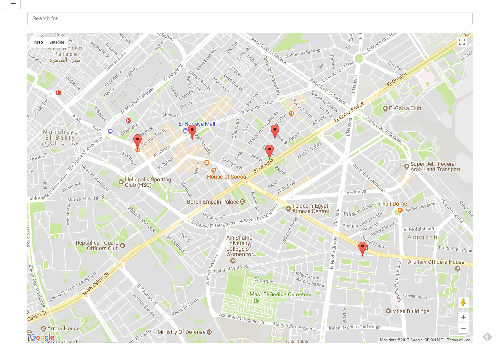
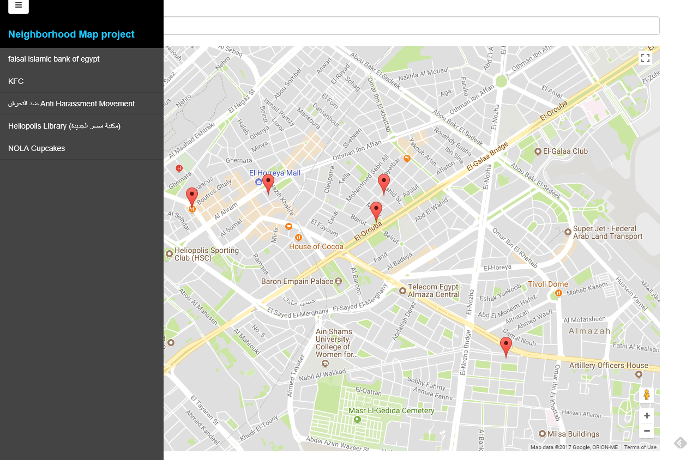

# Udacity Neighborhood Map

This project is a **Udacity Neighborhood Map**, It's a challange to test my skills calling various APIs. Making calls to Google Maps and other services like Foursquare.

All the locations are listed inside `./src/scripts/main.js` file you can change there lat and lng values.

Menu Closed

Menu opened

# How To install

1. Run command prompt into the directory.
2. Run `npm install`.
3. Run `bower install`.
4. Run `gulp`.
5. Or you can access from this [URL](neighborhood.surge.sh)

## Project details

- Styling the project design from this file `./src/styles/style.scss`.
- The project is using [Bootstrap](http://getbootstrap.com/), [jQuery](https://jquery.com/), [Knockoutjs](http://knockoutjs.com/), [Foursquare API](https://foursquare.com/)

### Contributing

No contribution needed for this project. Therefore, we most likely will not accept pull requests.